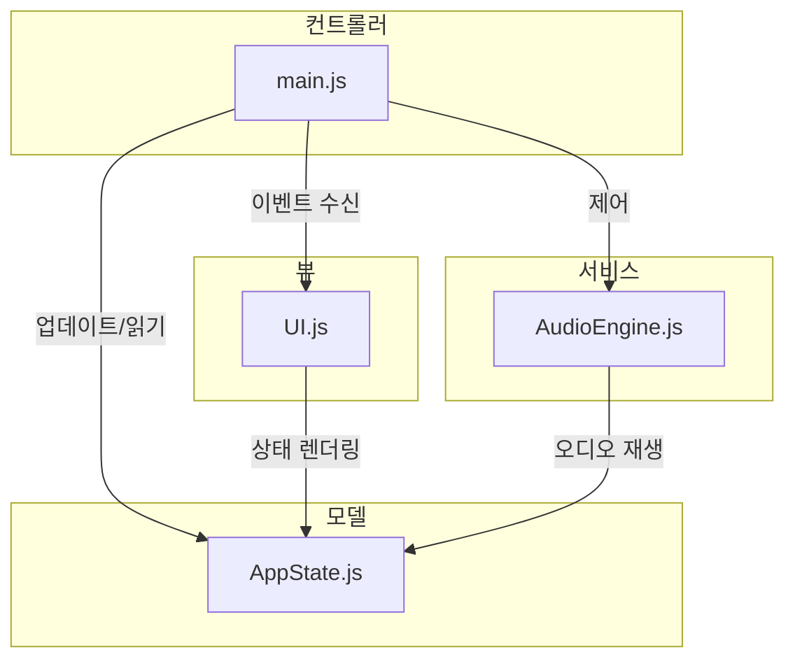

# 악기 시퀀서 설계 문서

이 문서는 `global_rules.md`에 정의된 원칙과 `requirements.md`의 요구사항에 따라 웹 기반 악기 시퀀서의 기술 설계를 설명합니다.

## 1. 아키텍처

단순한 Model-View-Controller (MVC) 유사 패턴을 채택하여 관심사를 명확하게 분리합니다 [CA, SF]. 이 아키텍처는 **작업 뷰(Edit View)**와 **프레젠테이션 뷰(Presentation View)** 두 가지 모드를 지원합니다.

*   **모델 (상태):** 그리드 구성, 샘플 할당, 템포, 트랙 설정 및 **현재 뷰 모드**를 포함한 애플리케이션의 상태를 관리합니다. 이 독립적인 상태는 저장/불러오기 기능을 위해 직렬화하기 쉽습니다.
*   **뷰 (UI):** 모델의 상태를 기반으로 사용자 인터페이스를 렌더링하는 역할을 합니다. `viewMode`에 따라 표시되는 요소를 동적으로 조정합니다.
    *   **작업 뷰**에서는 그리드, 샘플 업로드 버튼, 볼륨/피치 슬라이더, 템포 컨트롤 등 모든 컨트롤을 렌더링합니다.
    *   **프레젠테이션 뷰**에서는 모든 편집 컨트롤을 숨기고 재생 중인 클립의 시각적 피드백을 강조하는 미니멀하고 미학적인 인터페이스를 렌더링합니다.
*   **컨트롤러 (로직):** 중재자 역할을 합니다. 뷰에서 사용자 입력을 처리하고, 모델을 업데이트하며(`viewMode` 전환 포함), `AudioEngine`에 오디오 관련 작업을 수행하도록 지시합니다.



## 2. 핵심 컴포넌트

애플리케이션은 다음 JavaScript 모듈로 나뉩니다 [AC, CA].

*   **`main.js` (컨트롤러):**
    *   애플리케이션을 초기화합니다.
    *   `AppState`, `AudioEngine`, `UI`의 인스턴스를 생성합니다.
    *   모든 컴포넌트를 연결하고 이벤트 리스너와 핸들러를 설정합니다.
    *   주요 애플리케이션 로직을 포함합니다.

*   **`AppState.js` (모델):**
    *   시퀀서의 전체 상태를 보유합니다.
    *   제어된 방식으로 상태를 수정하는 메서드를 제공합니다.
    *   그리드 크기, 템포, 트랙 설정(볼륨, 피치) 및 각 개별 클립의 상태를 관리합니다.

*   **`UI.js` (뷰):**
    *   모든 직접적인 DOM 조작을 처리합니다.
    *   `AppState`을 기반으로 시퀀서 그리드를 동적으로 생성합니다.
    *   클립의 시각적 상태(예: 재생 중, 대기 중, 비어 있음)를 업데이트합니다.
    *   템포 입력, 볼륨/피치 슬라이더, 재생/정지 버튼과 같은 컨트롤을 렌더링합니다.
    *   `main.js`에서 처리할 사용자 상호작용 이벤트를 발생시킵니다.

*   **`AudioEngine.js` (서비스):**
    *   모든 Web Audio API 기능을 캡슐화합니다.
    *   `AudioContext`를 관리합니다.
    *   URL 또는 파일 업로드로부터 오디오 샘플을 `AudioBuffer`로 로드합니다.
    *   정확한 타이밍으로 클립 재생을 스케줄링하여 퀀타이즈를 구현합니다.
    *   스케줄 간격을 조정하여 템포 변경을 처리합니다.
    *   오디오 소스에 볼륨 및 피치 변경을 적용합니다.

## 3. 데이터 구조

*   **`AppState` 객체:**
    ```javascript
    {
      viewMode: 'edit', // 'edit' 또는 'present'
      tempo: 120,
      grid: {
        rows: 8,
        cols: 8
      },
      tracks: [ // 배열 길이는 grid.cols와 일치
        { volume: 1.0, pitch: 0 }, // 트랙 0
        { volume: 1.0, pitch: 0 }, // 트랙 1
        // ...
      ],
      clips: [ // 2D 배열 (rows x cols)
        [ { samplePath: null, state: 'empty', audioBuffer: null }, /* ... */ ],
        // ...
      ]
    }
    ```

*   **클립 상태:** `AppState.clips`의 각 클립은 다음 중 하나의 `state` 속성을 갖습니다:
    *   `'empty'`: 샘플이 로드되지 않음.
    *   `'stopped'`: 샘플이 로드되었지만 재생 중이 아님.
    *   `'pending'`: 사용자에 의해 트리거되었으며, 다음 퀀타이즈 비트에 재생 대기 중.
    *   `'playing'`: 현재 재생 중.

## 4. 주요 워크플로우

### 뷰 모드 전환
1.  전용 UI 버튼을 통해 사용자는 '작업' 모드와 '프레젠테이션' 모드 간에 전환할 수 있습니다.
2.  버튼을 클릭하면 `AppState`의 `viewMode` 속성이 업데이트됩니다.
3.  `UI` 컴포넌트는 이 상태 변경을 감지하고 편집 컨트롤을 표시하거나 숨기는 등 뷰를 다시 렌더링합니다.

### 재생 및 퀀타이즈
1.  중앙 스케줄링 루프(예: `setInterval` 사용)가 주기적으로(예: 25ms마다) 실행됩니다.
2.  이 루프는 작은 시간 창(예: 다음 100ms) 내에 스케줄링해야 할 예정된 노트를 확인합니다.
3.  사용자가 클립을 클릭하면 상태가 `'pending'`으로 설정됩니다.
4.  다음 퀀타이즈 비트(예: 템포에 따라 계산된 4분 음표마다)에서 스케줄러는 다음을 수행합니다:
    *   동일한 열에 있는 `'pending'` 상태의 클립을 찾아, 현재 `'playing'` 상태인 클립을 중지하고 새 클립을 시작합니다.
    *   비트에 대한 정확한 `audioContext.currentTime`을 계산하고 해당 순간에 `AudioBufferSourceNode`가 시작되도록 스케줄링합니다. 이는 샘플 수준의 정확한 타이밍을 보장합니다 [PA].

### 상태 저장/불러오기
1.  **저장:** 현재 `AppState` 객체를 `JSON.stringify()`를 사용하여 JSON 형식으로 문자열화합니다. 이 문자열은 사용자가 `.json` 파일로 다운로드할 수 있는 `Blob`을 만드는 데 사용됩니다. [SF]
2.  **불러오기:** 사용자가 `.json` 파일을 선택합니다. 파일은 텍스트로 읽혀 `JSON.parse()`를 사용하여 파싱되고, 결과 객체는 현재 `AppState`를 덮어씁니다. 그런 다음 이 새로운 상태에서 UI가 다시 렌더링됩니다. 샘플의 오디오 버퍼는 다시 로드해야 합니다.

## 6. UI 와이어프레임

아래는 애플리케이션의 두 가지 뷰 모드에 대한 시각적 레이아웃을 나타내는 와이어프레임입니다.

*   **[작업 뷰 와이어프레임 보기](./wireframe.svg):** 클립, 트랙 컨트롤, 글로벌 컨트롤 등 모든 기능이 포함된 기본 인터페이스입니다.
*   **[프레젠테이션 뷰 와이어프레임 보기](./wireframe_presentation.svg):** 모든 컨트롤을 숨기고, 재생 상태에 대한 시각적 피드백에만 집중하는 미니멀한 뷰입니다.

## 7. 제안된 파일 구조

```
/
├── index.html
├── css/
│   └── style.css
├── js/
│   ├── main.js
│   ├── AppState.js
│   ├── UI.js
│   └── AudioEngine.js
├── samples/
│   ├── kick.wav
│   ├── snare.wav
│   └── hihat.wav
└── docs/
    ├── requirements.md
    ├── global_rules.md
    └── design.md
```